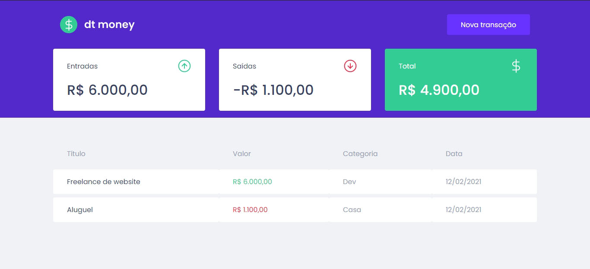
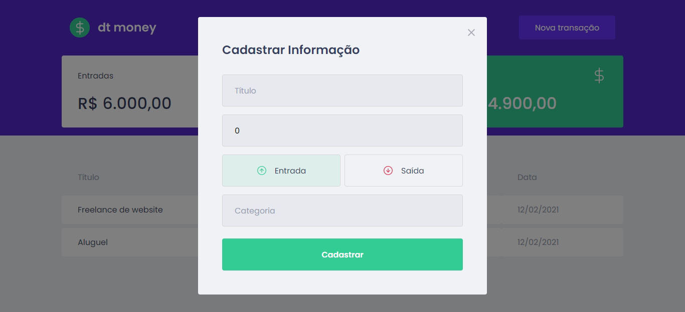

<h1 align="center">
      dt money
</h1>

<p align="center">  
 dt money é uma aplicação que foi desenvolvida durante o segundo modulo do Ignite da <a href="https://rocketseat.com.br/">Rocketseat</a>
</p>

<h4 align="center">
	🚧 Concluído 🚀 🚧
</h4>

Tabela de conteúdos
=================
<!--ts-->
   * [Sobre o projeto](#-sobre-o-projeto)
   * [Layout](#-layout)
     * [Web](#web)
   * [Como executar o projeto](#-como-executar-o-projeto)
   * [Tecnologias](#-tecnologias)
   * [Licença](#user-content--licença)
<!--te-->


## 💻 Sobre o projeto

<p>O projeto é uma aplicação de controle de finanças onde podemos registrar entradas e saídas da nossa conta, no painel aparece o total de entradas, saídas e o total atual na conta além do histórico de transações.</p>
<p>Para desenvolver essa aplicação foi utilizado algumas bibliotecas como styled components e para lidar com toda a logica usamos a Context API do React.</p>
<p>E por ultimo, usamos o Mirage JS para criar uma API de teste onde cadastramos e listamos todas as transações.</p>

## 🎨 Layout

### Web

<p align="center" style="display: flex; align-items: flex-start; justify-content: center;">
  
  
</p>

## 🚀 Como executar o projeto

### Pré-requisitos

Antes de começar, você vai precisar ter instalado em sua máquina as seguintes ferramentas:
[Git](https://git-scm.com), [Node.js](https://nodejs.org/en/). 
Além disto é bom ter um editor para trabalhar com o código como [VSCode](https://code.visualstudio.com/)

#### Rodando a aplicação web (Frontend)

```bash

# Clone este repositório
$ git clone https://github.com/Tuhh16/dtmoney-ignite-modulo-02.git

# Acesse a pasta do projeto no seu terminal/cmd
$ cd dtmoney-ignite-modulo-02

# Instale as dependências
$ yarn install

# Execute a aplicação em modo de desenvolvimento
$ yarn start

# A aplicação será aberta na porta:3000 - acesse http://localhost:3000

```

---

## 🛠 Tecnologias

As seguintes ferramentas foram usadas na construção do projeto:

-   **[ReactJs](https://pt-br.reactjs.org/)**
-   **[TypeScript](https://www.typescriptlang.org/)**

> Veja o arquivo  [package.json](https://github.com/Tuhh16/desafio-02-trilha-reactjs/blob/master/package.json)

---

## 📝 Licença

Este projeto esta sobe a licença [MIT](./LICENSE).

Feito por Arthur Teodoro Alves de Lima 👋🏽 [Entre em contato!](https://www.linkedin.com/in/arthur-lima-reactjs/)
