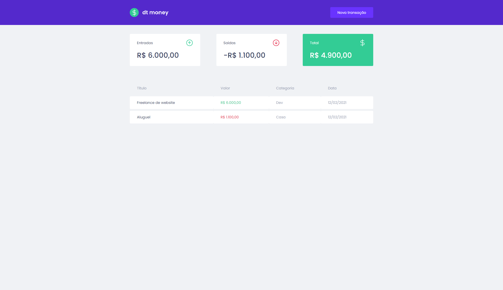

<h1 align="center">
      dt money
</h1>

<p align="center"> 
 dt money is an application that was developed during the second module of <a href="https://rocketseat.com.br/">Rocketseat's</a> Ignite program.
</p>

<h4 align="center">
	🚧 Completed 🚀 🚧
</h4>

Table of Contents
=================
<!--ts-->
   * [About the project](#-about-the-project)
   * [Layout](#-layout)
     * [Web](#web)
     * [Mobile](#mobile)
   * [Video](#-video)
   * [How to run the project](#-how-to-run-the-project)
   * [Technologies](#-technologies)
   * [License](#user-content--licença)
<!--te-->


## 💻 About the project

<p>The project is a financial control application where we can record income and expenses in our account. The dashboard displays the total income, expenses, and the current account balance, along with a transaction history.</p>
<p>To develop this application, we used some libraries such as styled-components and for handling all the logic, we utilized React's Context API.</p>
<p>Finally, we employed Mirage JS to create a test API where we can register and list all transactions.</p>

## 🎨 Layout

### Web

<p align="center" style="display: flex; align-items: flex-start; justify-content: center;">
  
  
</p>

### Mobile

<p align="center" style="display: flex; align-items: flex-start; justify-content: center;">
  
  
  
  
</p>

## 📹 Video

https://github.com/arthurtlima/ignite-modulo-2-dtmoney/assets/12513621/53026a09-4c6c-4a9b-94e8-a37606f26bac

## 🚀 How to run the project

### Prerequisites

Before you begin, you will need to have the following tools installed on your machine:
[Git](https://git-scm.com), [Node.js](https://nodejs.org/en/).
Additionally, it's good to have an editor for working with the code, such as [VSCode](https://code.visualstudio.com/)

After cloning this project, install the dependencies:

```
yarn install
```

And run using:

```
yarn start
```

Open [http://localhost:3000](http://localhost:3000) with your browser to see the result.

### 💻 Commands

- `start`: runs your application on `localhost:3000`
- `build`: creates the production build version
- `test`: runs jest to test all components and pages
- `eject`: removes this tool and copies build dependencies, configuration files and scripts into the app directory. If you do this, you can’t go back!

## 🛠 Technologies

The following tools were used in the project's construction:

-   **[ReactJs](https://pt-br.reactjs.org/)**
-   **[TypeScript](https://www.typescriptlang.org/)**
-   **[Styled Components](https://styled-components.com/)**
-   **[Mirage JS](https://miragejs.com/)**

## 📝 License

This project is under the license [MIT](./LICENSE).

Made by Arthur Teodoro Alves de Lima 👋🏽 [Get in touch!](https://www.linkedin.com/in/arthurtlima/)
